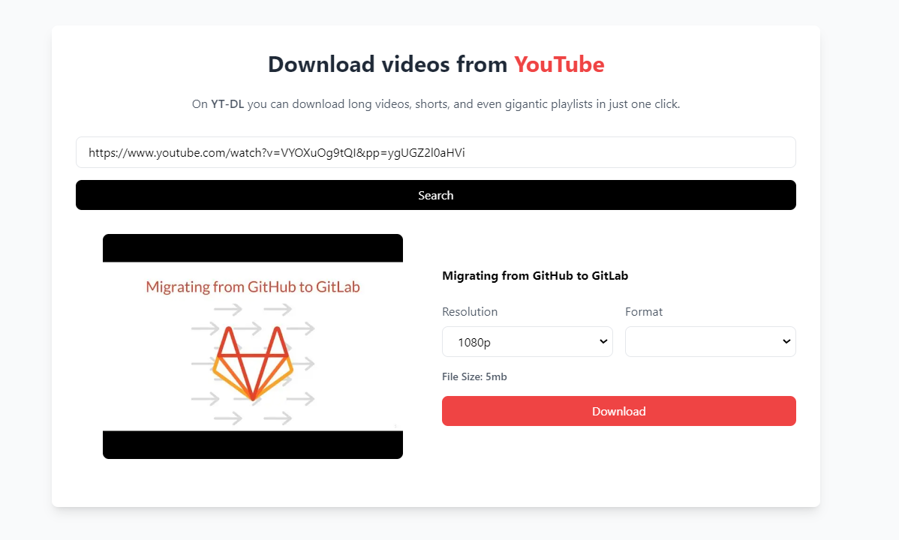

<h1 align="center">
   <br>
  YTDL
  <br>
</h1>

<h4 align="center">An Easy-to-use YouTube Downloader built using <a href="https://nextjs.org/" target="_blank">Next.js</a>.</h4>


<p align="center">
  <a href="#key-features">Key Features</a> •
  <a href="#how-to-use">How To Use</a> •
  <a href="#Live-preview">Live Link</a> •
  <a href="#disclaimer">Disclaimer</a> •
  <a href="#related">Related</a> •
  <a href="#license">License</a>
</p>



## Key Features

* **User Friendly** - Easy to use interface.
  - Click on Get Started and paste the URL of the video you'd like to download.
**Share Download Link** - Share the download link with your friends.(You don't have to download the video to share it)
* **High Quality Downloads** - 
* Syntax highlighting
* **Dark/Light mode** - Adapts to your system preferences, save your eyes from strain.
* **24/7 Support** - I'm always here to help you with any issues you may encounter.

## How To Use

To clone and run this web app, you'll need [Git](https://git-scm.com) and [Node.js](https://nodejs.org/en/download/) (which comes with [npm](http://npmjs.com)) installed on your computer. From your command line:

```bash
# Clone this repository
$ git clone https://github.com/preston176/ytdl-next

# Go into the repository
$ cd ytdl

# Install dependencies
$ npm install

# Run the app
$ npm run dev
# Open browser http://localhost:3000
```

## Live Preview

- ⚠️Under production


## Disclaimer

- Copyright Compliance: By using [YTDL](https://github.com/preston176/ytdl-next), you agree to comply with YouTube's terms of service and respect copyright laws. 
- It is **illegal** to download videos or audio content without the permission of the content owner. 
- [YTDL](https://github.com/preston176/ytdl-next) is intended for the download of content that you have the right to download, such as your own videos or content that is in the public domain or licensed under **Creative Commons**.

## Related

[AI-GEN](https://github.com/preston176/ai-gen) - AI Gen services from OpenAI

## Support

<a href='https://ko-fi.com/A0A1TVTET' target='_blank'></a>

## License

MIT

---

> [prestonmayieka.tech](https://www.prestonmayieka.tech) &nbsp;&middot;&nbsp;
> GitHub [@preston176](https://github.com/preston176) &nbsp;&middot;&nbsp;
> Twitter [@preston_mayieka](https://twitter.com/preston_mayieka)

